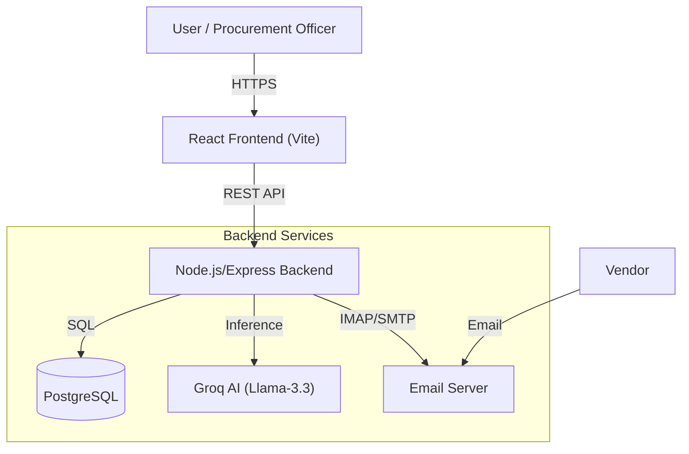
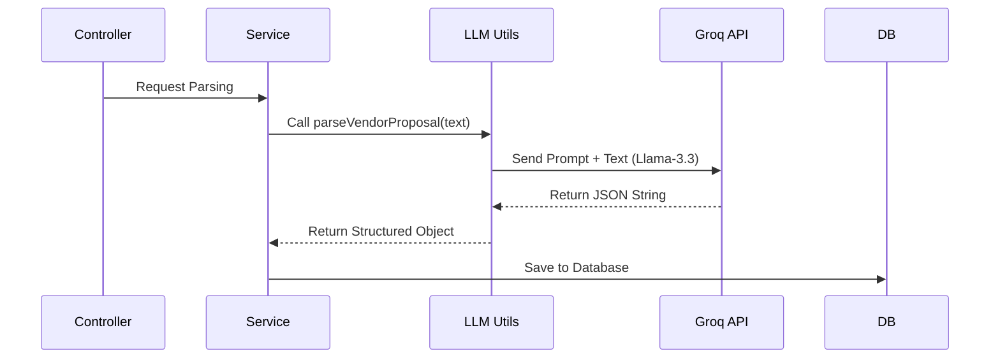
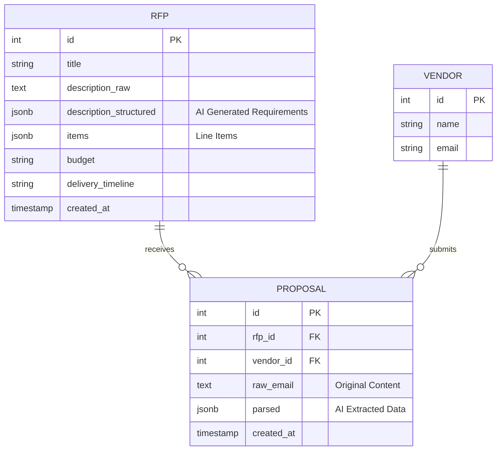

# Procuro — AI-Powered RFP Management System


**Procuro** is an enterprise-grade, AI-driven Request for Proposal (RFP) management platform. It automates the procurement lifecycle by leveraging Generative AI to parse unstructured vendor proposals, generate RFP requirements from natural language, and perform intelligent side-by-side comparisons of bids.

This project demonstrates a full-stack implementation of an AI agent workflow, integrating email protocols (IMAP/SMTP), vector-ready data structuring, and modern web architecture.

---
swagger docs - https://procuro.onrender.com/docs/
backend deployment - https://procuro.onrender.com

## 📋 Project Overview

Procuro addresses the inefficiency in manual procurement processes. Instead of manually reading dozens of PDF or email proposals and entering data into spreadsheets, Procuro uses the **Groq Llama-3.3-70b-versatile** model to:

1.  **Ingest** proposals directly from email or file uploads.
2.  **Parse** unstructured text into structured JSON data (pricing, timelines, warranty).
3.  **Compare** multiple vendors against the original RFP requirements automatically.

### Key Features

*   **🤖 AI-Powered RFP Generation:** Create detailed technical requirements from a simple one-sentence description using `generateRfp.js`.
*   **📧 Automated Proposal Ingestion:** Listens to a dedicated email inbox via IMAP, detecting and parsing vendor submissions automatically.
*   **📄 Intelligent Parsing:** Uses `parseProposal.js` to extract structured data (Budget, Delivery Time, Line Items) from raw vendor emails/documents.
*   **⚖️ Smart Comparison:** `compare.js` utilizes LLMs to generate a decision matrix, highlighting pros/cons and ranking vendors.
*   **🏢 Vendor & RFP Management:** Full CRUD capabilities for managing vendor registries and active RFPs.

---

## 🏗️ System Architecture (HLD)

The system is built on a decoupled client-server architecture. The backend serves as the central orchestrator, managing data persistence, AI inference, and email communication.



---

## 🔧 Low-Level Design (LLD)

The backend follows a **Controller-Service-Repository** pattern to ensure separation of concerns and testability.

### Module Breakdown

*   **API Layer (`src/api/`)**: Handles HTTP requests and validation.
    *   `rfp.controller.js`: Manages RFP lifecycle endpoints.
    *   `proposal.controller.js`: Handles proposal submission and parsing requests.
    *   `email.controller.js`: Triggers manual email sending.
*   **Service Layer (`*.service.js`)**: Contains business logic.
    *   `email.imap.js`: Background service that connects to the mail server to fetch unread messages.
*   **AI/LLM Layer (`src/utils/llm/`)**:
    *   `groqClient.js`: Singleton client for the Groq SDK, configured for `llama-3.3-70b-versatile`.
    *   `generateRfp.js`: Contains prompt engineering to convert user intent into structured RFP JSON.
    *   `parseVendorProposal.js`: Specialized extraction logic to map vendor free-text to RFP schema.
    *   `compare.js`: Aggregates multiple proposal JSONs and asks the LLM to rank them.

### LLM Pipeline Flow



---

## 🗄️ Database Schema

The database is normalized to link Proposals to specific RFPs and Vendors.



---

## 📡 API Overview

### RFP Routes
| Method | Endpoint | Description |
| :--- | :--- | :--- |
| `POST` | `/rfp` | Create a new RFP manually. |
| `GET` | `/rfp` | Retrieve all RFPs. |
| `GET` | `/rfp/:id` | Get full details of a specific RFP. |
| `POST` | `/rfp/from-text` | **AI:** Generate structured RFP from a text description. |
| `GET` | `/rfp/:id/compare` | **AI:** Generate a comparison matrix for all proposals linked to this RFP. |

### Vendor Routes
| Method | Endpoint | Description |
| :--- | :--- | :--- |
| `POST` | `/vendors` | Register a new vendor in the system. |
| `GET` | `/vendors` | List all registered vendors. |

### Proposal Routes
| Method | Endpoint | Description |
| :--- | :--- | :--- |
| `POST` | `/proposals` | Submit a proposal manually. |
| `POST` | `/proposals/parse` | **AI:** Parse raw proposal text into JSON without saving. |
| `GET` | `/proposals/rfp/:rfpId` | Get all proposals submitted for a specific RFP. |
| `GET` | `/proposals/:id` | Get details of a specific proposal. |

### Email Routes
| Method | Endpoint | Description |
| :--- | :--- | :--- |
| `POST` | `/email/send` | Send an email notification (e.g., RFP invitation) to a vendor. |

---

## 🔄 Data Flow Explanation

### 1. Vendor Proposal Ingestion (The "Magic" Flow)
1.  **Reception:** A vendor replies to an RFP email.
2.  **Detection:** `email.imap.js` detects the new unread email.
3.  **Extraction:** The email body is extracted and passed to `parseVendorProposal.js`.
4.  **AI Processing:** Groq (`llama-3.3-70b-versatile`) analyzes the text to find:
    *   Total Cost
    *   Proposed Timeline
    *   Deviations from requirements
5.  **Storage:** The structured result is stored in the `proposal` table, linked to the vendor and RFP.

### 2. Comparison Generation
1.  **Trigger:** User clicks "Compare Proposals" on the frontend.
2.  **Aggregation:** Backend fetches the RFP requirements and all linked parsed proposals.
3.  **Analysis:** `compare.js` constructs a prompt containing the RFP criteria and the anonymized vendor data.
4.  **Result:** The LLM returns a markdown or JSON summary table highlighting the best candidate, which is displayed on the frontend.

---

## 🚀 Setup Instructions (Local)

### Prerequisites
*   Node.js v18+
*   PostgreSQL installed and running
*   Groq API Key

### 1. Backend Setup

```bash
# Navigate to backend
cd backend

# Install dependencies
npm install

# Configure Environment
cp .env.example .env
# Edit .env with your DB credentials and Groq API Key

# Initialize Database
# Run the SQL commands in src/db/models.sql against your Postgres instance

# Start Server
npm run dev
```

### 2. Frontend Setup

```bash
# Navigate to frontend
cd frontend

# Install dependencies
npm install

# Start Vite Server
npm run dev
```

### 3. Running Together
Ensure the backend is running on port `3000` (default) and frontend on `5173`. The frontend is configured to proxy requests or point directly to `http://localhost:3000`.

---

## ☁️ Deployment Instructions (Render)

### Backend (Web Service)
1.  **Build Command:** `npm install`
2.  **Start Command:** `node src/server.js`
3.  **Environment Variables:** Add `DATABASE_URL`, `LLM_API_KEY`, `SMTP_*`, `IMAP_*`.

### Frontend (Static Site)
1.  **Build Command:** `npm run build`
2.  **Publish Directory:** `dist`
3.  **Rewrite Rules:** To handle client-side routing and API proxying, add a `_redirects` file or configure Render rewrites:
    *   `/* /index.html 200` (for React Router)
    *   `/api/* https://your-backend-service.onrender.com/api/:splat 200` (for API proxying)

---

## 🛠️ Tech Stack

| Category | Technology | Purpose |
| :--- | :--- | :--- |
| **Frontend** | React, TypeScript, Vite | User Interface & State Management |
| **Backend** | Node.js, Express | API & Business Logic |
| **Database** | PostgreSQL | Relational Data Storage |
| **AI Model** | **Groq (Llama-3.3-70b)** | High-speed Inference for Parsing & Reasoning |
| **Email** | Nodemailer, ImapFlow | SMTP Sending & IMAP Listening |
| **Docs** | Swagger / OpenAPI | API Specification |

---

## 📸 Screenshots


*   **Dashboard View:** Overview of active RFPs.


  
*   **RFP Creation:** AI-assisted form for generating requirements.
  

*   **Comparison Matrix:** Side-by-side view of vendor proposals.

  


---

## 🔮 Future Improvements

*   **Document OCR:** Integrate Vision models to parse PDF attachments in emails.
*   **Real-time WebSockets:** Push notifications to the frontend when a new email proposal arrives.
*   **Vendor Portal:** A dedicated login for vendors to submit proposals via a structured form instead of email.
*   **Auth0 Integration:** Enterprise-grade SSO for procurement teams.


